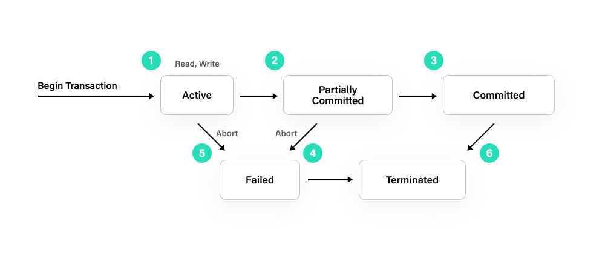

1. 관계형 데이터베이스(RDBMS)와 비관계형 데이터베이스(NoSQL)의 장단점 비교

#### RDBMS (Relational Database Management Systems)
가장 널리 쓰이는 데이터베이스 형태로, 테이블 형태로 행, 열로 데이터를 구분하여 저장하는 형태이다.
여러 개의 테이블을 각자 목적에 맞게 만들고 그 테이블 사이에 중복되는 (공유되는) 자원을 기준으로
테이블 간의 관계를 설정하여 데이터베이스를 구성한다.

##### 장점
- ACID(Atomic, Consistent, Isolated, Durable) compliance
  - 안정적으로 트랜잭션이 일어날 수 있도록 해준다.
- Data Accuracy
- Normalization
- Simplicity

##### 단점
- Scalability
- Flexibility
- Performance

#### NoSQL (Not-only SQL)
관계형 모형을 사용하지 않는 테이블 간의 조인 기능이 없는 데이터 베이스.
초고용량 데이터 처리, 단기간에 많은 수로 발생하는 데이터에 특화된 데이터 베이스로,
유연하고 높은 퍼포먼스를 내는 것이 특징이다.
NoSQL에서 사용되는 데이터 구조는 다음과 같다.
- Key-Value
- Wide Columnar Store
- Document DB
- Graph DB

Source: https://www.mongodb.com/compare/relational-vs-non-relational-databases      
Source: https://www.geeksforgeeks.org/difference-between-relational-database-and-nosql/

2. 트랜잭션(transaction)이란 무엇인가요?

#### Transaction

데이터베이스의 상태를 변환시키는 하나의 논리적 기능을 수행하기 위한 작업의 단위
또는 한꺼번에 수행되어야 하는 일련의 연산을 의미한다.

예를 들어, 웹사이트에서 사용자들이 한꺼번에 어떤 상품을 장바구니에 넣고 결제 버튼을 눌렀을 때,
재고 상태를 정확히 (더도 말고, 덜도 말고) 계산해야 하는데, 이럴 때 바로 데이터베이스의 트랜잭션이
사용된다.

다시 말해, 데이터베이스 트랜잭션은 '발생했던가' 아니면 '아예 일어나지 않은 상태로 있는' 
둘 중의 하나의 상태만을 가진다.

- Atomicity
- Consistency
- Isolation
- Durability

Source: https://fauna.com/blog/database-transaction

3. MySQL에서 조인(join)의 역할은 무엇인가요? 다양한 join의 방식에 대해 설명해주세요.

#### Inner Join / Cross Join

#### Left Join / Right Join

#### Natural Join?

https://dev.mysql.com/doc/refman/8.0/en/join.html

4. MySQL에서 인덱스(index)란 무엇인가요?

#### Index

https://dev.mysql.com/doc/refman/8.0/en/mysql-indexes.html